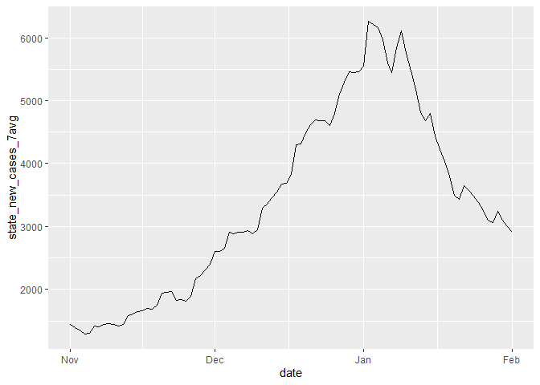

Rt functions
================

## Notes

**Please consult the associated packages for more information**

### Function output

Each function outputs six fields

- `date` is the day for the Rt estimation
- `mean_rt` is the mean Rt value for that day
- `se_rt` is the standard error for the mean Rt value
- `ll_95_rt` is the lower limit of the 95% confidence interval
- `ul_95_rt` is the upper limit of the 95% confidence interval
- `week` is the week for that day

Each function has an argument to specify whether you want output in a
daily format or a weekly average. Weeks are programmed for Sunday to
Saturday. All functions take daily data for their input. Some functions
require additional arguments. See below for examples of each function
and the data preparation.

### Packages (general)

``` r
# data wrangling
library(dplyr)
library(zoo)
library(tidyr)
library(lubridate)

# analysis
library(EpiEstim)
library(quantmod) # find peaks
library(broom)

# plots
library(ggplot2)

# DATA
dat <- readRDS("../data/Rt_data_state.rds")

# we want one epidemic curve: Nov 2023 to Feb 1 2024
dat_curve <- dat %>%
  filter(date >= "2023-11-01" & date <= "2024-02-01")

ggplot()+
  geom_line(data = dat_curve, aes(x = date, y = state_new_cases_7avg))
```

<!-- -->

### Rt from case data using EpiEstim

The data input is a two column data frame, date and case data in a daily
time series.

``` r
# Reference model - case based Rt
source("functions/Rt-EpiEstim-functions.R")

# example county df
cases_df <- dat_curve %>%
  ungroup() %>%
  select(date, state_new_cases_7avg) %>%
  rename(Date = date) 

# Rt from  case data with SI 4 (not much difference in the unknown si results)
rt_cases_daily <- rt_function(cases_df, mean_si = 4, std_si = 1, weekly = "No")
```

### Rt using Fit line method

- Dataframe with date, predictor, field called Rt that is the Rt from
  case data
- Can take normalized and raw wastewater data

``` r
# METHOD 1 - Fit line method
source("functions/Rt-fit-line-function.R")

#extract ww data and join it to rt data
ww_data <- dat_curve %>%
  select(date, state_sars2)%>%
  arrange(date) 

# one dataframe for the county with ww data and rt from case data
data_fit_line <- inner_join(ww_data, rt_cases_daily, c("date")) %>%
  rename(rt = mean_rt)

# run function
rt_fit_weekly <- rt_fit_line_function(dataframe = data_fit_line, weekly = "Yes", range = 45, predictor = "state_sars2")
```

### Rt using GLM roll

Function inputs

- Wastewater data dataframe (daily data)
- Predictor name (what is predicting the case data)
- Case data field name (also daily data)
- Range to go back in time for the GLM (window size for fitting the GLM)
- Whether the serial interval (SI) is known or not (if known, provide
  mean and std si)
- Weekly output or not

``` r
# METHOD 2 - Rolling GLM
source("functions/Rt-glm-roll.R")

# wastewater data and case data
ww_data <- dat_curve %>%
  select(date, state_sars2, state_new_cases_7avg)%>%
  arrange(date) 

# run the function
rt_glm_weekly <- rt_glm_function(dataframe = ww_data,
                                 predictor = "state_sars2",
                                 case_data = "state_new_cases_7avg",
                                 range = 45,
                                 unknown_si = "Yes",
                                 mean_si = 4,
                                 std_si = 1,
                                 weekly = "Yes")
```

### Rt EpiEstim substitution

Function inputs

- Dataframe with two columns, one for date and one for the predictor
  (date is first column)
- Mean and std SI if SI is known
- Weekly (yes or no)

``` epiestim
# METHOD 3 - EpiEstim Substitution
source("functions/Rt-EpiEstim-substitution.R")

# wastewater data
ww_data <- dat_curve %>%
  select(date, state_sars2)%>%
  arrange(date) 

# run function
start_time <- Sys.time()
rt_ww_sub <- rt_ww_sub_function(dataframe = ww_data, mean_si = 4, std_si = 1,  weekly = "Yes", unknown_si = "Yes")
end_time <- Sys.time()
epiestim_sub_time <- end_time - start_time
```

### Rt exp change rate

Function inputs

- Dataframe with two columns, one for date and one for predictor
- Specify the change rate window (i.e., how many data points to
  calculate the change between. Today v. yesterday, today v. 7 days ago,
  etc)
- Output is daily or weekly

``` r
# METHOD 4 - Exp. Change rate
source("functions/Rt-exp-change-rate.R")

# select county level data
ww_data <- dat_curve %>%
  select(date, state_sars2)%>%
  arrange(date) 

# log sars 2
ww_data$state_sars2 <- log(ww_data$state_sars2)

# test the function
rt_exp_weekly <- rt_change_rate_function(dataframe = ww_data, change_window = 1, weekly = "Yes")
```

### Huisman et al. method

Function inputs

- Input dataframe with two columns, one for date and one for predictor.
  Daily data are needed.

``` r
# METHOD 5 - Huisman
source("functions/Rt-huisman-functions.r")

# filter for county we want to analyze
ww_data <- dat_curve %>%
  select(date,state_sars2)%>%
  arrange(date) 

# run function
rt_huisman_weekly <- rt_huisman_function(dataframe = ww_data, region = "statewide", weekly = "Yes")
```

### Goldstein et al. 

The process developed by Goldstein et al. uses Julia software. Please
refer to their [GitHub page](https://github.com/igoldsteinh/concRt) for
information on installation.

The metohd uses an EIRR compartmental model. The compartments represent
the following:

- E - estimated observed infections

- I - estimated unobserved infections

- R1 - estimated number of recovered population

- R2 - starting reproduction number calculated from case data

The function in this repo is a wrapper for the functions in their
package.

``` r
# METHOD 6 - Goldstein
library(concRt)
library(JuliaCall)
library(ggplot2)
library(tidyr)
library(tibble)
library(dplyr)
library(cowplot)
library(scales)
library(latex2exp)
library(tidybayes)
library(stringr)

# follow https://github.com/igoldsteinh/concRt
julia <- julia_setup()

# load required julia package 
julia_library("concRt")

# prep data
ww_data <- dat %>%
  select(date, state_sars2)%>%
  arrange(date) %>%
  mutate(lag_sars2.7avg = lag(state_sars2, 4, default = NA)
  )%>%
  ungroup() %>%
  select(date, lag_sars2.7avg) %>%
  filter(!is.na(lag_sars2.7avg)) %>%
  filter(date >= "2023-11-01" & date <= "2024-02-01")

# load function
source("functions/rt-eirr-function.R")

# priors

prior_case_df <- dat %>%
  filter(date <= min(ww_data$date) - days(18)) %>%
  arrange(desc(date)) %>%
  head(18) %>%
  arrange(date)

new_df <- prior_case_df %>%
  tail(11) %>%
  mutate(total_c = sum(state_new_cases_7avg) * 5 * 1/3,
         total_i = sum(state_new_cases_7avg) * 5 * 2/3)
E_temp <- head(new_df$total_c, 1)
I_temp <- head(new_df$total_i, 1)
R1_temp <- sum(prior_case_df$state_new_cases_7avg) * 5

# prior rt
Rt_temp <- rt_function(prior_case_df %>%
                         select(date, state_new_cases_7avg), mean_si = 4, std_si = 1, weekly = "Yes")
Rt_temp <- mean(Rt_temp$mean_rt)

# run analysis
state_eirr <- eirr_function(dataframe = ww_data, log = "Yes",
                            E_prior = E_temp, I_prior = I_temp, R1_prior = R1_temp,
                            Rt_prior = Rt_temp)
```

### `EpiSewer` R package

The `EpiSewer` method relies on the `EpiSewer` [R
package](https://github.com/adrian-lison/EpiSewer) and uses Stan
software. Please see the package instructions for installation. The
function in this repo is a wrapper for the functions in `EpiSewer`.

``` r
# METHOD 7 - EpiSewer

library(EpiSewer)
library(data.table)
library(ggplot2)
library(Matrix)
library(dplyr)
library(lubridate)

#cmdstanr::check_cmdstan_toolchain(fix = TRUE) 
cmdstanr::check_cmdstan_toolchain()
cmdstanr::install_cmdstan(cores = 2) # use more cores to speed up

# DATA
data.state <- readRDS("/home/dthill/Rt_wastewater/Rt_data_state.rds")
source("functinos/Rt-EpiSewer-function.R")

# prep data
data.input <- data.state %>%
  dplyr::select(date, state_flow, state_new_cases_7avg, state_sars2) %>%
  rename(conc = state_sars2,
         cases = state_new_cases_7avg,
         flow = state_flow) %>%
  arrange(date) %>%
  filter(date >= "2023-11-01" & date <= "2024-02-01")

# run function - weekly for the entire state
episewer_state <- rt_episewer_function(
  dataframe = data.input,
  weekly = "Yes",
  cores_use = 8,
  chains = 8,
  iter_warmup_n = 500,
  iter_sampling_n = 500
)
```

### `ern`

The `ern` method uses and R package for estimating the Rt from
wastewater or case data. The function in this repo, `Rt_ERN_function` is
a wrapper for that package’s function.

``` r
# METHOD 8 - ERN
source("Rt-ERN-Function.R")

# load package
library(ern)

ww.data <- dat_curve %>%
  select(date, state_sars2, state_new_cases_7avg) %>%
  rename(value = state_sars2,
         cases_new.7avg = state_new_cases_7avg)

start_time <- Sys.time()
ern_90 <- Rt_ERN_function(dataframe = ww.data, weekly = "Yes")
end_time <- Sys.time()
ern_time <- end_time - start_time
saveRDS(ern_90, "ern_90.rds")
```
